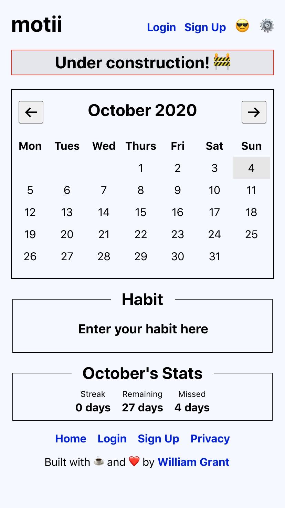
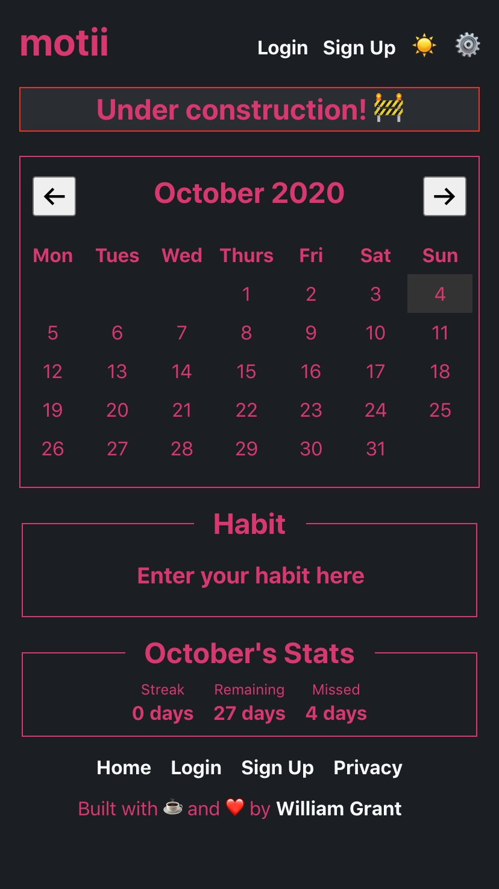
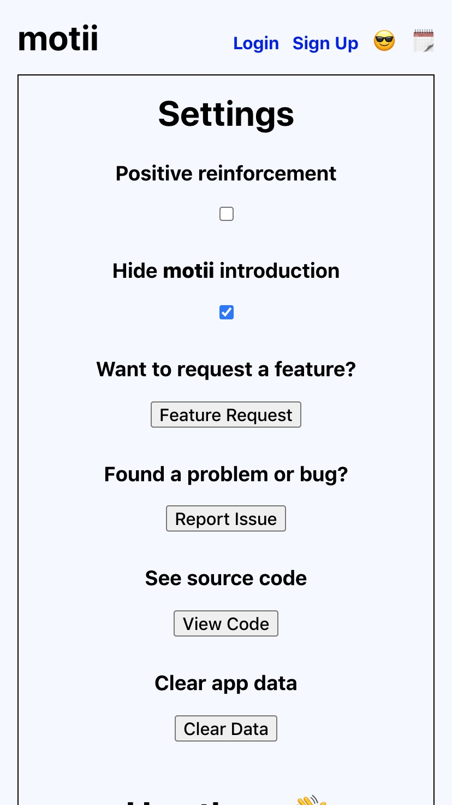
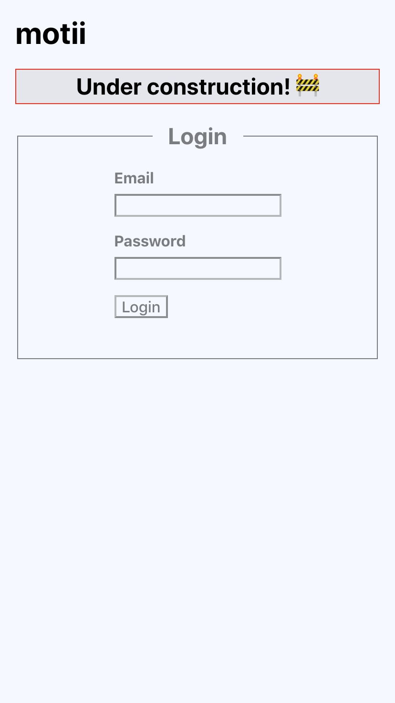
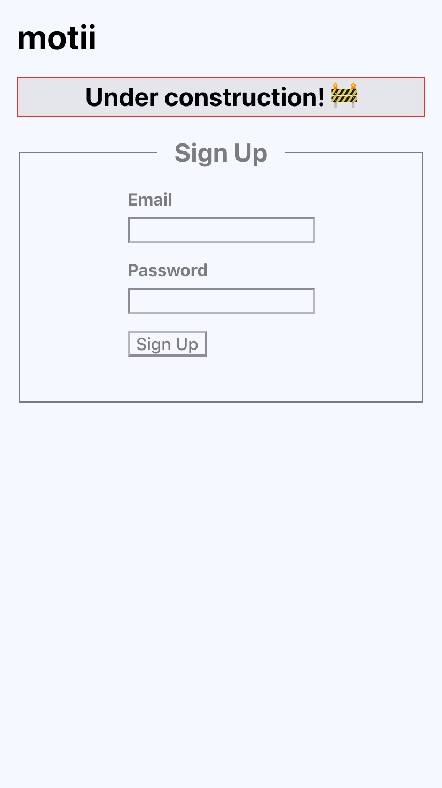
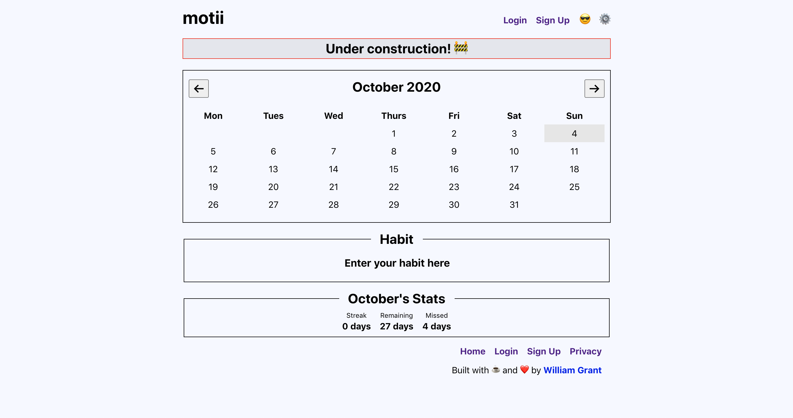
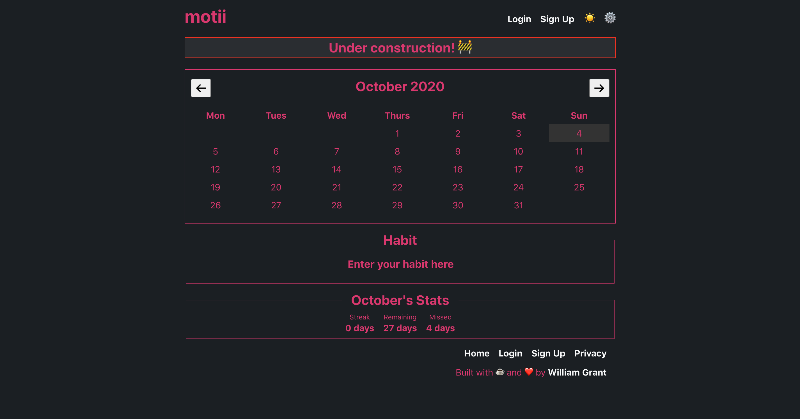

# motii (🚧 under construction 🚧)

*the motivational calendar*

motii is a calendar that helps people motivate themselves when starting new habits using encouragement and positive reinforcement.

***It’s not a habit forming, it's habit rewarding.***

This project was bootstrapped with [Create React App](https://github.com/facebook/create-react-app).

## Features

- [x] Beautiful minimal design
- [x] [React Router](https://reactrouter.com/) for page navigation
- [x] Custom Modal system built using React Portals.
- [x] React Hooks (useState, useEffect, useRef)
- [x] Functional Components
- [x] Robust and persistent data handling for user data and settings via localStorage
- [x] Light and Dark theme
- [x] Mobile First Design

## Screenshots

### Mobile

#### Settings

#### Login

#### Sign Up

### Desktop

## Development

- Did you notice a bug? Please report it [here](https://github.com/yougotwill/motii/issues/new?labels=bug&template=bug_report.md)
- Want to request a feature? Please let me know [here](https://github.com/yougotwill/motii/issues/new?labels=enhancement&template=feature_request.md')
